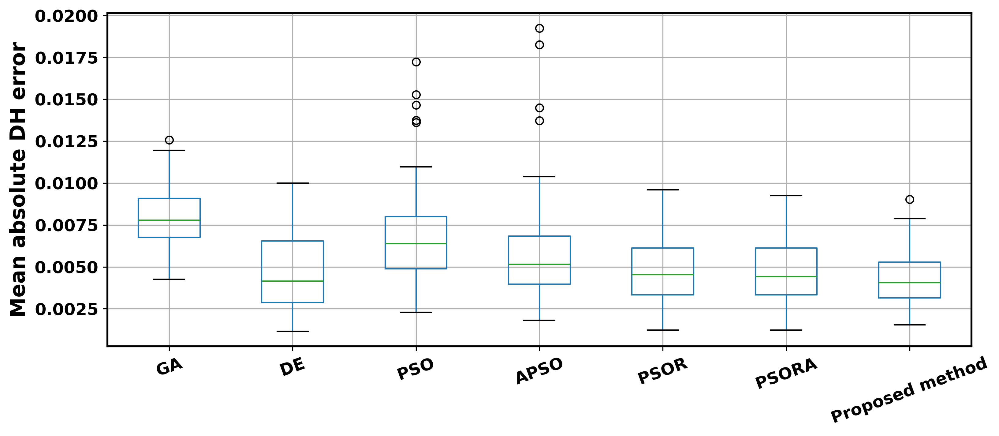
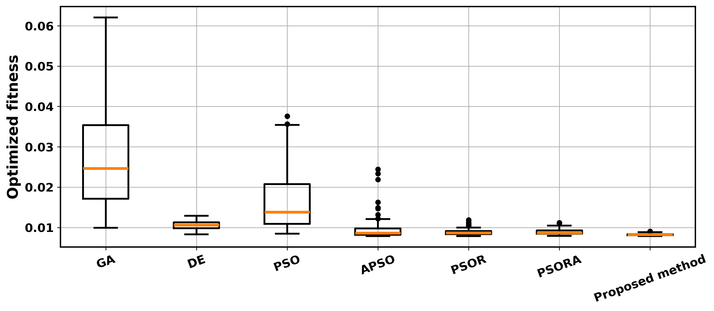
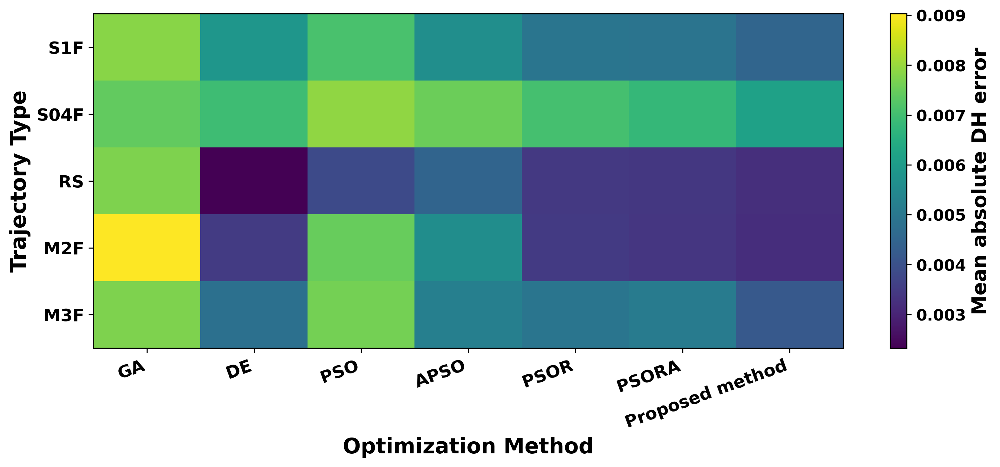
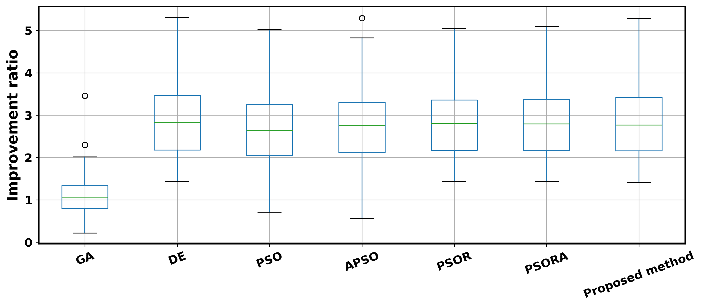
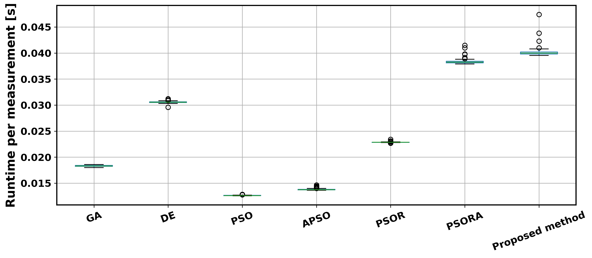

# Diversity-Aware Adaptive Swarm Optimization for Online Robot Calibration

## Overview

This repository contains the implementation of a diversity-aware adaptive Particle Swarm Optimization (PSO) framework for online robot kinematic calibration.

The proposed approach extends the classical PSO algorithm through the integration of:

* Ring-topology swarm communication
* Aging-based swarm memory adaptation
* Diversity-driven fuzzy parameter adaptation

The framework was developed to improve optimization robustness and convergence stability under continuously changing measurement conditions, making it suitable for online robot calibration scenarios.

The proposed method is evaluated against several commonly used evolutionary and swarm-based optimization approaches, including:

* Classical PSO
* Adaptive PSO (APSO)
* Differential Evolution (DE)
* Genetic Algorithm (GA)

---

## Installation

### Clone the repository

```bash
git clone https://github.com/your_username/your_repository.git
cd your_repository
```

### Create a virtual environment (recommended)

```bash
python -m venv venv
```

Activate the environment:

**Windows**

```bash
venv\Scripts\activate
```

**Linux / macOS**

```bash
source venv/bin/activate
```

### Install dependencies

Install all required packages using:

```bash
pip install -r requirements.txt
```

---

## Experimental Setup
The experimental setup is presented in the `test.py` script for each individual algorithm or in the `test_all.py` script for all algorithms.

For the `test.py` script use the following command:

```bash
python test.py --pso <method_name>  
```
where `<method_name>` can be:
- PSO_1 (Classical PSO)
- PSO_2 (PSO with ring-topology)
- PSO_3 (PSO with ring-topology and aging memory)
- PSO_4 (The proposed method)
- DE (Differential Evolution)
- GA (Genetic Algorithm)
- APSO (Adaptive PSO)
---
The evaluation framework simulates online robot calibration for a serial robotic manipulator using Denavit–Hartenberg (DH) parameter identification.

### Robot Model

* 6-DOF serial manipulator
* Standard DH parameterization
* Perturbed ground-truth model generated using Gaussian parameter noise

### Measurement Simulation

Synthetic end-effector measurements are generated using forward kinematics and noisy observations:

* Position noise:

  * $\sigma_p = 0.003$ m
* Orientation noise:

  * $\sigma_o = 0.002$ rad

### Trajectory Categories

The following trajectory types are evaluated:

| ID   | Description                               |
| ---- | ----------------------------------------- |
| S1F  | Sinusoidal trajectory (frequency = 1.0)   |
| S04F | Sinusoidal trajectory (frequency = 0.4)   |
| RS   | Random smooth trajectory                  |
| M2F  | Mixed-frequency trajectory (2 components) |
| M3F  | Mixed-frequency trajectory (3 components) |

Each trajectory is evaluated using multiple random seeds to ensure statistical consistency.

### Benchmark Methods

The proposed method is compared against:
|Method name |Implementation file |
|---------------------------------------------|-------------|
|PSO                                          |(`_1pso.py`)|
|APSO                                         |(`_8apso.py`)|
|DE                                           |(`_6de.py`)|
|GA                                           |(`_7ga.py`)|
|Ring-topology PSO (PSOR)                     |(`_2pso.py`)|
|Ring-topology PSO with Aging Memory (PSORA)  |(`_3pso.py`)|
|Proposed Diversity-Aware Adaptive PSO        |(`_4pso.py`)|

### Evaluation Metrics

Performance is evaluated using:

* Mean absolute DH parameter error
* Optimized fitness value
* Improvement ratio
* Runtime per optimization iteration
* DH component-wise errors

---

## Running the Experiments

Execute the calibration benchmark:

```bash
python test_all.py 
```

The generated results are stored as CSV files and can be analyzed using:

```bash
python analyze_results.py
```

Generated outputs include:

* LaTeX tables
* Performance rankings
* Boxplots
* Heatmaps
* Statistical summaries

---

## Results

The proposed diversity-aware adaptive PSO framework was evaluated against several evolutionary and swarm-based optimization methods, including PSO, APSO, DE, and GA. The results demonstrate that the combination of ring-topology communication, aging-based memory adaptation, and diversity-driven fuzzy parameter regulation significantly improved calibration performance and robustness.

### Calibration Accuracy



The proposed method achieved the lowest overall DH parameter estimation error among all evaluated optimization approaches. In addition to the reduced median error, the method also exhibited the smallest distribution spread, indicating improved robustness and more consistent convergence behavior across different trajectories and random initialization seeds.

### Optimization Fitness



The optimized fitness values further confirm the effectiveness of the proposed framework. The proposed method consistently achieved the lowest fitness values while maintaining a compact distribution, demonstrating stable convergence and reduced sensitivity to measurement noise and local minima.

### Trajectory-wise Performance



The trajectory-wise comparison shows that the proposed framework maintained superior performance across all investigated motion profiles, including sinusoidal, random smooth, and mixed-frequency trajectories. This behavior indicates strong generalization capability and reduced dependence on trajectory-specific excitation conditions.

### Calibration Improvement



The proposed framework produced the highest overall calibration improvement ratio compared to the initial uncalibrated model. The results demonstrate that the adaptive swarm mechanisms consistently enhanced the parameter identification process regardless of the trajectory type.

### Runtime Performance



The adaptive mechanisms introduced additional computational overhead compared to conventional PSO-based approaches. Nevertheless, the achieved runtime remained suitable for online robot calibration applications, allowing real-time processing of measurement streams while preserving improved calibration accuracy and robustness.

### Summary

Experimental evaluation demonstrated that the proposed diversity-aware adaptive PSO framework:

- Achieved the highest calibration accuracy across all investigated trajectory categories.
- Produced the best overall fitness values.
- Demonstrated improved robustness against measurement noise and random initialization.
- Maintained stable performance across varying excitation trajectories.
- Reduced performance variability compared to classical PSO and evolutionary optimization methods.
- Remained computationally feasible for practical online robot calibration scenarios despite the increased adaptive complexity.

---

## Repository Structure

```text
.
├── test.py
├── test_all.py
├── _1pso.py
├── _2pso.py
├── _3pso.py
├── _4pso.py
├── _6de.py
├── _7ga.py
├── _8apso.py   
├── analyze_results.py
├── requirements.txt
├── LICENSE
└── README.md
├── benchmark_analysis
│   ├── boxplot_dh_error.png
│   ├── boxplot_fitness.png
│   ├── boxplot_improvement_ratio.png
│   ├── boxplot_runtime.png
│   ├── heatmap_trajectory_method_dh_error.png
│   ├── dh_component_error_table.tex
│   ├── main_results_table.tex
│   ├── method_ranking.csv
│   ├── summary_by_method.csv
│   ├── summary_by_trajectory.csv
│   ├── trajectory_method_dh_error_matrix.csv   

```

---

## Citation

If you use this repository in your research, please cite the corresponding publication:

```bibtex

```

---

## License

This project is licensed under the MIT License. 

See the LICENSE file for full details.
